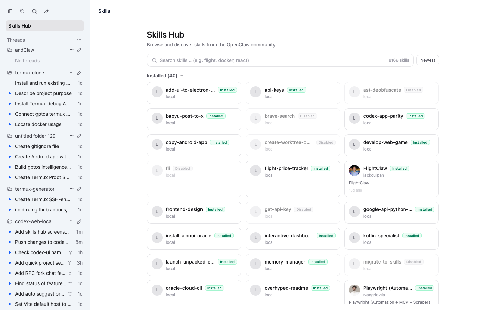
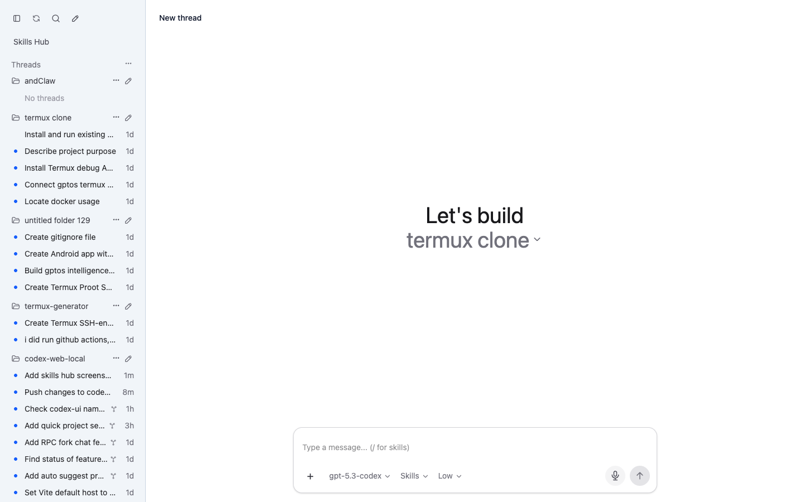

# 🔥 codexapp

### 🚀 Run Codex App UI Anywhere: Linux, Windows, or Termux on Android 🚀

[](https://www.npmjs.com/package/codexapp)
[](#-quick-start)
[](https://nodejs.org/)
[](./LICENSE)

> **Codex UI in your browser. No drama. One command.**
>  
> **Yes, that is your Codex desktop app experience exposed over web UI. Yes, it runs cross-platform.**

```text
 ██████╗ ██████╗ ██████╗ ███████╗██╗  ██╗██╗   ██╗██╗
██╔════╝██╔═══██╗██╔══██╗██╔════╝╚██╗██╔╝██║   ██║██║
██║     ██║   ██║██║  ██║█████╗   ╚███╔╝ ██║   ██║██║
██║     ██║   ██║██║  ██║██╔══╝   ██╔██╗ ██║   ██║██║
╚██████╗╚██████╔╝██████╔╝███████╗██╔╝ ██╗╚██████╔╝██║
 ╚═════╝ ╚═════╝ ╚═════╝ ╚══════╝╚═╝  ╚═╝ ╚═════╝ ╚═╝
```

---


## 🤯 What Is This?
**`codexapp`** is a lightweight bridge that gives you a browser-accessible UI for Codex app-server workflows.

You run one command. It starts a local web server. You open it from your machine, your LAN, or wherever your setup allows.  

**TL;DR 🧠: Codex app UI, unlocked for Linux, Windows, and Termux-powered Android setups.**

---

## ⚡ Quick Start
> **The main event.**

```bash
# 🔓 Run instantly (recommended)
npx codexapp

# 🌐 Then open in browser
# http://localhost:5900
```

The server prints an auth token on startup. Enter that token in the browser login screen, or set your own with `--auth-token` / `CODEXUI_AUTH_TOKEN`.

To choose the listening address and port:

```bash
npx codexapp --host 0.0.0.0 --port 5900 --auth-token your-token
```

If you are using a provider or AI gateway that is already authenticated and do not want `codexapp` to force `codex login` during startup, use:

```bash
npx codexapp --no-login
```

If Codex is installed somewhere outside `PATH`, point `codexapp` at the executable used to run `codex app-server`:

```bash
npx codexapp --codex-command /absolute/path/to/codex
```

The value is saved in `~/.codex/webui-runtime.json`. You can also set `CODEXUI_CODEX_COMMAND=/absolute/path/to/codex`; the environment variable takes precedence over the saved value.

### Complete Commands

Run from source with a fixed token, host, port, and the Codex binary bundled inside Codex.app:

```bash
pnpm install

CODEXUI_CODEX_COMMAND=/Applications/Codex.app/Contents/Resources/codex \
CODEXUI_AUTH_TOKEN=your-token \
pnpm run dev -- --host 0.0.0.0 --port 5900
```

Run the built CLI from this checkout:

```bash
pnpm run build

CODEXUI_CODEX_COMMAND=/Applications/Codex.app/Contents/Resources/codex \
node dist-cli/index.js \
  --host 0.0.0.0 \
  --port 5900 \
  --auth-token your-token \
  --no-open \
  --no-login
```

Or pass the Codex path as a CLI flag:

```bash
node dist-cli/index.js \
  --host 0.0.0.0 \
  --port 5900 \
  --auth-token your-token \
  --codex-command /Applications/Codex.app/Contents/Resources/codex \
  --no-open \
  --no-login
```

Run the published package through `npx`:

```bash
CODEXUI_CODEX_COMMAND=/Applications/Codex.app/Contents/Resources/codex \
CODEXUI_AUTH_TOKEN=your-token \
npx codexapp@latest \
  --host 0.0.0.0 \
  --port 5900 \
  --no-open \
  --no-login
```

Equivalent `npx` command using only CLI flags:

```bash
npx codexapp@latest \
  --host 0.0.0.0 \
  --port 5900 \
  --auth-token your-token \
  --codex-command /Applications/Codex.app/Contents/Resources/codex \
  --no-open \
  --no-login
```

Flag notes:

- `--no-open`: do not automatically open a browser window after the server starts. The server still starts normally and prints the URL; you open it yourself.
- `--no-login`: skip the Codex CLI login bootstrap during startup. This only skips `codex login` checks/prompts; it does **not** disable codexUI bearer-token auth. If the Codex provider needs an OpenAI/Codex account and you are not logged in, run `codex login` separately or remove `--no-login`.
- `--auth-token`: sets the static bearer token that the browser must enter on the login screen and that API requests must send as `Authorization: Bearer <token>`.
- `--host`: listening address. Use `0.0.0.0` for LAN/reverse-proxy access, or `127.0.0.1` for local-only access.
- `--port`: listening port.

### Docker isolated run

Docker can reduce host filesystem exposure by running `codexapp` and the Codex CLI inside a Linux container and mounting only the directories you choose. The macOS Codex.app binary at `/Applications/Codex.app/Contents/Resources/codex` cannot be executed inside the default Linux Docker container, so the image installs and uses a Linux `codex` CLI in `PATH`.

Build the image from this checkout:

```bash
docker build -t codexui:local .
```

Create a separate Codex home for the container instead of mounting your host `~/.codex` directly:

```bash
mkdir -p "$HOME/.codex-docker"
```

If the container Codex CLI needs login state, initialize it into that separate directory:

```bash
docker run --rm -it \
  -v "$HOME/.codex-docker:/home/node/.codex" \
  --entrypoint codex \
  codexui:local login
```

Run the UI with only the required workspace mounted. The Docker image defaults Codex to `CODEXUI_SANDBOX_MODE=workspace-write` and `CODEXUI_APPROVAL_POLICY=on-request`; override those environment variables only when you intentionally want a different Codex runtime policy.

```bash
docker run --rm -it \
  --name codexui \
  -p 127.0.0.1:5900:5900 \
  -e CODEXUI_AUTH_TOKEN=your-token \
  -v "$HOME/.codex-docker:/home/node/.codex" \
  -v "$PWD:/workspace" \
  codexui:local
```

Use a narrower workspace mount when possible, for example `-v "/Users/puper/Documents/projects/my-project:/workspace"`. Avoid mounting the whole host home directory unless you intentionally want Codex to access it.

Optional harder container limits:

```bash
docker run --rm -it \
  --name codexui \
  --cap-drop=ALL \
  --security-opt no-new-privileges \
  --pids-limit=512 \
  --memory=4g \
  --cpus=2 \
  --read-only \
  --tmpfs /tmp:rw,nosuid,nodev,noexec,size=512m \
  --tmpfs /home/node/.cache:rw,nosuid,nodev,size=256m \
  -p 127.0.0.1:5900:5900 \
  -e CODEXUI_AUTH_TOKEN=your-token \
  -v "$HOME/.codex-docker:/home/node/.codex" \
  -v "$PWD:/workspace" \
  codexui:local
```

Security boundary notes:

- Docker limits filesystem access to mounted paths, but it is not a full sandbox against Docker daemon or kernel/container escape issues.
- The image defaults Codex to `workspace-write` instead of `danger-full-access`, so writes should stay within the selected workspace unless you change the policy.
- Network access is still available by default because Codex/provider APIs need outbound requests. Use firewall rules or Docker network policy if outbound traffic must be restricted.
- Mounting `~/.ssh`, cloud credentials, browser profiles, or your real `~/.codex` gives the container access to those secrets. Prefer a separate `.codex-docker` directory and project-specific mounts.

### Publishing

Before publishing, verify the package:

```bash
git status --short
pnpm install
pnpm run build
pnpm run test:unit
```

Bump the version and publish to npm:

```bash
pnpm version patch
npm login
npm publish --access public
```

Validate the published package:

```bash
npx codexapp@latest --help

CODEXUI_CODEX_COMMAND=/Applications/Codex.app/Contents/Resources/codex \
CODEXUI_AUTH_TOKEN=your-token \
npx codexapp@latest --host 0.0.0.0 --port 5900 --no-open --no-login
```

If npm prints warnings such as `Unknown project config "side-effects-cache"` or `Unknown project config "package-import-method"`, remove old project-level pnpm-only `.npmrc` entries before running npm commands.

### Linux 🐧
```bash
node -v   # should be 18+
npx codexapp
```

### Windows 🪟 (PowerShell)
```powershell
node -v   # 18+
npx codexapp
```

### Termux (Android) 🤖
```bash
pkg update && pkg upgrade -y
pkg install nodejs -y
npx codexapp
```

Android background requirements:

1. Keep `codexapp` running in the current Termux session (do not close it).
2. In Android settings, disable battery optimization for `Termux`.
3. Keep the persistent Termux notification enabled so Android is less likely to kill it.
4. Optional but recommended in Termux:
```bash
termux-wake-lock
```
5. Open the shown URL in your Android browser. If the app is killed, return to Termux and run `npx codexapp` again.

---

## iPhone / iPad via HTTPS Reverse Proxy

If you want to use codexUI from iPhone or iPad Safari, serving it over HTTPS is recommended.

A practical private setup is to run codexUI locally and publish it behind an HTTPS reverse proxy that you control:

```powershell
npx codexapp --port 5900
```

This setup worked well in practice for:

- iPhone Safari access
- Add to Home Screen
- the built-in dictation / transcription feature in the app
- viewing the same projects and conversations from the Windows host

Notes:

- on iOS, HTTPS / secure context appears to be important for mobile browser access and dictation
- some minor mobile Safari CSS issues may still exist, but they do not prevent normal use
- reverse proxy access still requires the codexUI bearer token printed at startup, or the token supplied with `--auth-token`
- if conversations created in the web UI do not immediately appear in the Windows app, restarting the Windows app may refresh them

---

## ✨ Features
> **The payload.**

- 🚀 One-command launch with `npx codexapp`
- 🌍 Cross-platform support for Linux, Windows, and Termux on Android
- 🖥️ Browser-first Codex UI flow on `http://localhost:5900`
- 🌐 LAN-friendly access from other devices on the same network
- 🧪 Remote/headless-friendly setup for server-based Codex usage
- 🔌 Works behind a trusted HTTPS reverse proxy
- ⚡ No global install required for quick experimentation
- 🎙️ Built-in hold-to-dictate voice input with transcription to composer draft

---

## 🧩 Recent Product Features (from main commits)
> **Not just launch. Actual UX upgrades.**

- 🗂️ Searchable project picker in new-thread flow
- ➕ "Create Project" button next to "Select folder" with browser prompt
- 📌 New projects get pinned to top automatically
- 🧠 Smart default new-project name suggestion via server-side free-directory scan (`New Project (N)`)
- 🔄 Project order persisted globally to workspace roots state
- 🧵 Optimistic in-progress threads preserved during refresh/poll cycles
- 📱 Mobile drawer sidebar in desktop layout (teleported overlay + swipe-friendly structure)
- 🎛️ Skills Hub mobile-friendly spacing/toolbar layout improvements
- 🪟 Skill detail modal tuned for mobile sheet-style behavior
- 🧪 Skills Hub event typing fix for `SkillCard` select emit compatibility
- 🎙️ Voice dictation flow in composer (`hold to dictate` -> transcribe -> append text)

---

## 🌍 What Can You Do With This?

| 🔥 Use Case | 💥 What You Get |
|---|---|
| 💻 Linux workstation | Run Codex UI in browser without depending on desktop shell |
| 🪟 Windows machine | Launch web UI and access from Chrome/Edge quickly |
| 📱 Termux on Android | Start service in Termux and control from mobile browser |
| 🧪 Remote dev box | Keep Codex process on server, view UI from client device |
| 🌐 LAN sharing | Open UI from another device on same network |
| 🧰 Headless workflows | Keep terminal + browser split for productivity |
| 🔌 Custom routing | Put behind a reverse proxy if needed |
| ⚡ Fast experiments | `npx` run without full global setup |

---

## 🖼️ Screenshots

### Skills Hub


### Chat


### Mobile UI


---

## 🏗️ Architecture

```text
┌─────────────────────────────┐
│  Browser (Desktop/Mobile)   │
└──────────────┬──────────────┘
               │ HTTP/WebSocket
┌──────────────▼──────────────┐
│         codexapp            │
│  (Express + Vue UI bridge)  │
└──────────────┬──────────────┘
               │ RPC/Bridge calls
┌──────────────▼──────────────┐
│      Codex App Server       │
└─────────────────────────────┘
```

---

## 🎯 Requirements
- ✅ Node.js `18+`
- ✅ Codex app-server environment available
- ✅ Browser access to host/port
- ✅ Microphone permission (only for voice dictation)

---

## 🐛 Troubleshooting

| ❌ Problem | ✅ Fix |
|---|---|
| Port already in use | Run on a free port or stop old process |
| `npx` fails | Update npm/node, then retry |
| Codex binary is not found | Start with `--codex-command /absolute/path/to/codex` or set `CODEXUI_CODEX_COMMAND` |
| Termux install fails | `pkg update && pkg upgrade` then reinstall `nodejs` |
| Can’t open from other device | Check firewall, bind address, and LAN routing |

---

## 🤝 Contributing
Issues and PRs are welcome.  
Bring bug reports, platform notes, and setup improvements.

---

## ⭐ Star This Repo
If you believe Codex UI should be accessible from **any machine, any OS, any screen**, star this project and share it. ⭐

<div align="center">
Built for speed, portability, and a little bit of chaos 😏
</div>

---

Maintained at [puper/codexUI](https://github.com/puper/codexUI).
